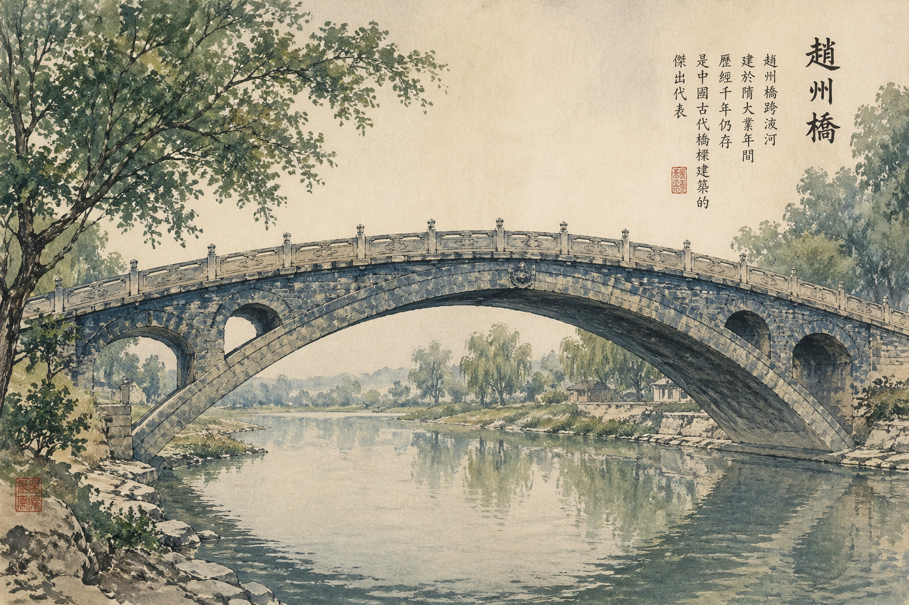

# 赵州桥 2D 动画改编案例

这个案例展示的是一条 `制片驱动` 的视频 agent 流程如何接管现成剧本，并把它整理成可以继续进入生产层的前期生产包。

它不是一键出片案例，而是 `production packet` 案例。

## 案例目标

- 输入：`赵州桥故事剧本`
- 风格：`2D 国风手绘动画`
- 范围：`改编 -> 故事包 -> 美术包 -> 分镜 -> 审核反馈 -> 制片整合`

## 这套 Agent 群怎么分工

| 角色 | 做了什么 | 关键输出 |
|---|---|---|
| 制片 Agent | 接需求、冻结方向、限定阶段范围 | `brief.md`、`adaptation_notes.md`、`producer_log.md` |
| 编剧 Agent | 保留鲁班造桥与八仙试桥的核心传奇，重组节奏 | `story_package.md` |
| 美术设计 Agent | 锁定角色、服化道、桥体与风格提示词，并做测试图 | `art_package.md`、`art-tests/*.png` |
| 副导演 Agent | 按故事和美术材料拆分镜，指出高风险镜头 | `storyboard.md`、`ad_feedback.md` |
| 制片整合 | 汇总剧本、美术、分镜和审核意见，形成生产包 | `schedule.md`、`production_todo.md`、`production_packet.md`、`project-state.yaml` |

## 这个案例重点验证什么

- 现成剧本能不能被改编进 agent 流程，而不是被粗暴重写
- 美术提示词能不能和故事节奏、角色设定、桥体结构对齐
- 制片能不能把零散文档整理成生产层能直接执行的 packet

## 重点文件

- [brief.md](brief.md)
- [story_package.md](story_package.md)
- [art_package.md](art_package.md)
- [storyboard.md](storyboard.md)
- [ad_feedback.md](ad_feedback.md)
- [production_packet.md](production_packet.md)

## 代表性输出

### 编剧阶段

- 把原故事收束为 `180 秒 / 12 镜头`
- 强化高潮：`桥心惊变 -> 鲁班托桥 -> 仙迹留桥`

### 美术阶段

- 明确 `2D 国风手绘动画`
- 锁定鲁班、张果老、柴王爷、白驴、赵州桥的结构锚点
- 回写 4 张测试图验证风格方向

### 副导演阶段

- 标出 `09`、`10` 为高风险镜头
- 要求补 `桥体结构图`、`仙迹定位图`、`桥下托桥 key art`

### 制片整合阶段

- 先锁 `03、09、10、12` 为测试镜头
- 按 `P0 / P1 / P2` 拆生产优先级
- 形成可交给生产 Agent 的 `production packet`

## 图片预览

鲁班角色测试：

赵州桥桥体测试：

其余测试图保留在 `art-tests/` 目录，不在这里全部展开。
